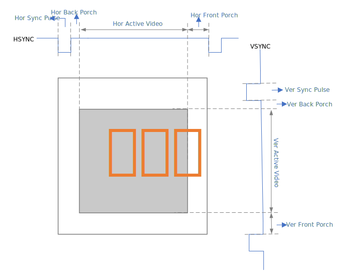
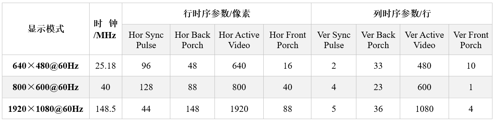
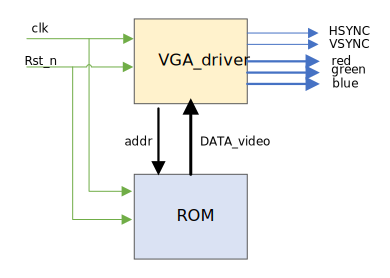

# VGA接口时序  
> [参考资料来源](https://www.cnblogs.com/liujinggang/p/9690504.html)  

### VGA接口简介  
VGA关键的接口有：  
- HSYNC：行同步信号  
- VSYNC：场同步信号  
- RED：红色分量数据  
- GREEN：绿色分量数据  
- BLUE：蓝色分量数据  
- 其它接口要么是底线，要么是标识位  

VGA的显示方式是逐行扫描，一行扫描完了，回到下一行行首开始扫描，因此在正脉冲期间，有部分时间用于扫描点归位。  

VGA接口时序：  
  

VGA常用分辨率时序参数：  
  

时钟是计算而来的，以640×480@60Hz为例，一帧图VGA要扫描的点数为(96+48+640+16)×(2+23+480+10)=800×525，同时一秒要显示60帧图，则一秒内要扫描的点数为800×525×60=25.2MHz  

### VGA驱动设计与Verilog实现  
VGA驱动定义与整体设计：
  

在显示区的每个像素点都包括红绿蓝分量数据，这就涉及到图片的位深度，比如图片的位深度为24，即一般红绿蓝各占8-bit。因此，需要显示时，每次从ROM读取24-bit数据，其中包括红绿蓝各8-bit。  

另外，VGA传输的是模拟型号，因此，红绿蓝信号需要经经过位数对应的DAC，转化为模拟信号。  

```Verilog
module vga_driver
# (parameter ROM_depth = 128)
(
    input                           clk         ,   //clk=25.2MHz
    input                           rst_n       ,
    input       [23:0]              DATA_video  ,
    output                          HSYNC       ,
    output                          VSYNC       ,
    output reg  [7;0]               red         ,
    output reg  [7;0]               green       ,
    output reg  [7;0]               blue        ,
    output reg  [2**ROM_depth-1,0]  addr
);

//参数定义
parameter   H_SYNC_PULSE    = 96   ,
            H_BACK_PORCH    = 48   ,
            H_ACTIVE_TIME   = 640  ,
            H_FRONT_PORCH   = 16   ,
            H_LINE_PERIOD   = 800  ;

parameter   V_SYNC_PULSE    = 2    ,
            V_BACK_PORCH    = 33   ,
            V_ACTIVE_TIME   = 480  ,
            V_FRONT_PORCH   = 10   ,
            V_FRAME_PERIOD  = 525  ;

//产生行时序
reg [9:0] H_cnt;
always @(posedge clk or negedge rst_n)
begin
    if (!rst_n)
        H_cnt <= 10'd0;
    else if (H_cnt == H_LINE_PERIOD-1)
        H_cnt <= 10'd0;
    else
        H_cnt <= H_cnt + 1'b1;
end
assign HSYNC = (H_cnt < H_SYNC_PULSE) ? 1'b0 : 1'b1;

//产生场时序
reg [9:0] V_cnt;
always @(posedge clk or negedge rst_n)
begin
    if (!rst_n)
        V_cnt <= 10'd0;
    else if (V_cnt == V_FRAME_PERIOD-1)
        V_cnt <= 10'd0;
    else
        V_cnt <= V_cnt + 1'b1;
end
assign VSYNC = (V_cnt < V_SYNC_PULSE) ? 1'b0 : 1'b1;

//确定显示区域
reg display_flag;
assign display_flag = ( (H_cnt >= H_SYNC_PULSE+H_BACK_PORCH)        &&
                        (H_cnt <= H_LINE_PERIOD-H_FRONT_PORCH)      &&
                        (V_cnt >= V_SYNC_PULSE+V_BACK_PORCH)        &&
                        (V_cnt <= V_FRAME_PERIOD-V_FRONT_PORCH)     &&
                        ) ? 1'b1 : 1'b0;

//产生地址
always @(posedge clk or negedge rst_n or display_flag)
begin
    if (!rst_n)
        addr <= 2**ROM_depth'd0;
    else if (display_flag)
        addr <= addr + 1'b1;
end

//读像素点RGB数据
always @(posedge clk or negedge rst_n or display_flag)
begin
    if (display_flag)
        {red, green, blue} <= DATA_video;
    else
        {red, green, blue} <= 24'd0;
end
```

