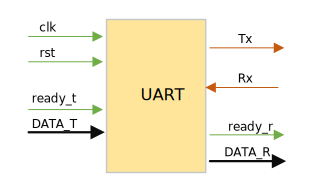

# UART说明  
> Univesal asynchronous receiver transmitter  


### 接口说明  
接口：  
- Tx：串行数据发送口  
- Rx：串行数据接收口  

数据格式：起始位0 | 数据位5-8bit | 校验位 | 停止位1  
先传输低位数据  


### UART设计Verilog  
  

```verilog
//本设计没有考虑波特率，默认以时钟的节拍发送接收数据
//没有校验位
module UART_RT(
    input               clk     ,
    input               rst_n   ,
    input               ready_t ,   //高有效
    input       [7:0]   DATA_T  ,   //8-bit数据
    input               Rx      ,   //高为空闲
    output  reg         Tx      ,
    output  reg         ready_r ,   //高有效
    output  reg [7:0]   DATA_R
);

//发送数据  
reg [3:0] cnt;
reg [1:0] state;
parameter   init    =   2'b00   ,
            trans   =   2'b01   ,
            finish  =   2'b10   ;
always  @(posedge clk or negedge rst_n)
begin
    if (!rst_n)
    begin
        Tx      <=  1'b1;
        ready_r <=  1'b0;
        state   <=  init;
    end
    else
    case(state)
        init:
            begin
                cnt     <=  4'd0;
                if (ready_t)
                    begin
                    Tx      <=  1'b0;
                    state   <=  trans;
                    end
                else
                    begin
                    Tx      <=  1'b1;
                    state   <=  init;
                    end
            end
        trans:
            begin
                Tx  <=  DATA_T[cnt];
                if (cnt == 4'd7)
                    begin
                    cnt     <=  4'd0;
                    state   <=  finish;
                    end
                else
                    begin
                    cnt     <=  cnt + 4'd1;
                    state   <=  trans;
                    end
            end
        finish:
            begin
            Tx      <=  1'b1;   //一个结束位
            state   <=  init;
            end
        default:
            begin
            Tx      <=  1'b1;
            state   <=  init;
            end
end

//接收数据
reg [7:0]   DATA_temp;
reg [3:0]   cnt_r;
reg [1:0]   state;
parameter   idle    =   2'b00,
            receive =   2'b01,
            fini_r  =   2'b10;
always  @(negedge clk or negedge rst_n)
begin
    if  (!rst_n)
        ready_r <=  1'b0;
        state   <=  idle;
    else
        case(state)
            idle:
                begin
                    ready_r <=  1'b0;
                    cnt_r   <=  4'd0;
                    if(Rx == 1'b0)
                        state   <=  receive;
                    else
                        state   <=  edle;
                end
            receive:
                begin
                    DATA_temp[cnt_r]    <=  Rx;
                    if  (cnt_r == 4'd7)
                        begin
                        cnt_r   <=  4'd0;
                        state   <=  fini_r;
                        end
                    else
                        begin
                        cnt_r   <=  cnt_r + 4'd1;
                        state   <=  receive;
                        end
                end
            fini_r:
                begin
                ready_r <=  1'b1;
                DATA_R  <=  DATA_temp;
                state   <=  idle;
                end
            default:
                begin
                    ready_r <=  1'b0;
                    state   <=  idle;
                end
end
```